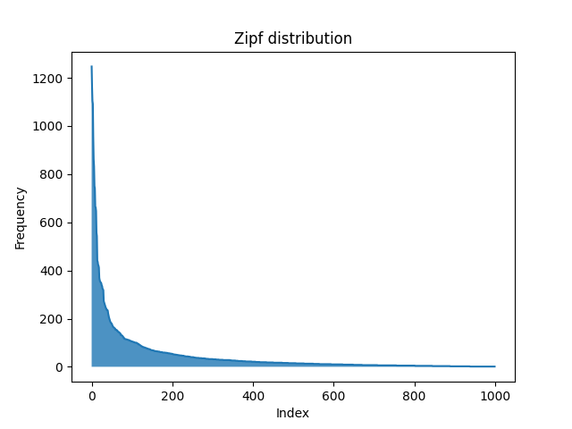
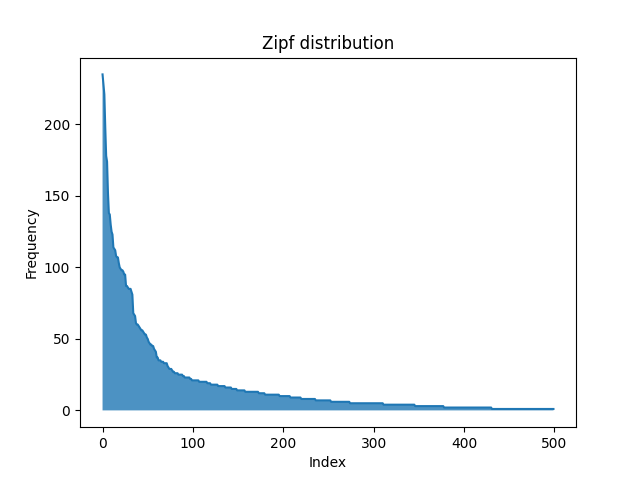
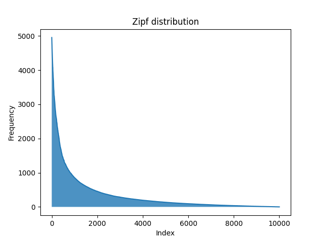

#  Rejection-inversion sampling on Zipfian distributions.

This project uses Hörmann-Derflinger rejection-inversion sampling to generate uint64 integers for a zipfian/skewed distribution.

## What is a Zipfian/Zipf distribution?

A zipf distribution is a discrete distribution where the frequency of an item is inversely proportional to its rank.

It is characterized by a few items appearing more frequently than the rest in a large dataset. This can be observed in things like the most used words. A few of the words are disproportionately used more often that the rest.

It follows [Zipf's law](https://en.wikipedia.org/wiki/Zipf%27s_law) which states that  ***"when a set of measured values is sorted in decreasing order, the value of the n-th entry is often approximately inversely proportional to n"***

## What is rejection-inversion sampling?

Rejection sampling is a method for sampling complex distributions, like Zipf, in an efficient way. This project utilizes the Hörmann-Derflinger method published in the [paper](https://research.wu.ac.at/ws/portalfiles/portal/19844727/document.pdf).

The Hörmann-Derflinger rejection-inversion method is an algorithm for sampling from discrete, monotone distributions that generates candidates by inverting the integral of a continuous approximation and then accepts them via a lightweight rejection check ensuring the discrete probability mass is respected.

## How to use.

Ensure you Go installed.

0. Install the package

```Go
go get github.com/oryankibandi/zipf
```

1. Import the package.

```go
package main

import (
    zipfian "github.com/oryankibandi/zipf/zipf"
)
```

2. Initialize with your values of s, v and imax:

    s - Zipfian exponent. This determines how much skew to apply.

    v - offset. It controls how much probability mass sits in the head. If you plot a graph of values, a  larger v relative to imax will produce more values in the head of the graph.

    imax - Upper bound of the graph. It truncates the Zipf tail to a finite number of integers. Should be > 1.

```go
z := zipfian.NewZipf(2, 1, 100)

if z == nil {
	panic("Unable to create Zipf generator")
}
```

3. Sample values

```go
    count := 100
    values := make([]uint64, count)
    
    for range 100 {
        values = append(values, z.GetNext())
    }
```

## showcase

The following shows sample graphs based on selected parameters.

1. 1000 items. s = 2.3, v = 20, imax = 1500



2. 500 items. s = 1.8, v = 5, imax = 250



3. 10000 items, s = 2.3, v = 200, imax = 5000



Observing the graphs, a lot of the frequency occurs on a few items, located in the head of the graph. Adjusting imax, v and s changes how the graphs appear.
